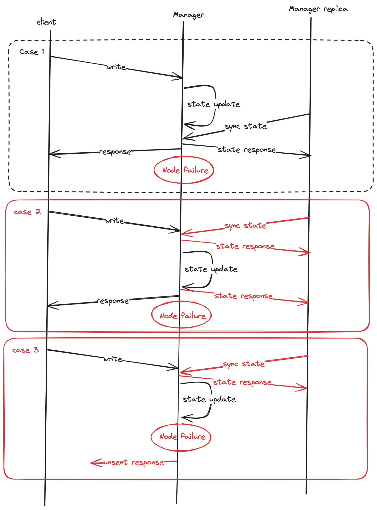

# Question 1: First implement the Ivy architecture discussed in the class.

## Run the project
Use the following command to run the project
```bash
go run main.go
```

## HTTP Server
To interact with the service, I implemented a simple HTTP server. The server will listen to the port 8080 and accept the following requests:
## Write
```bash
curl "localhost:8080/write?node=1&page=pg2&content=abc"
```
This command initiate a write request to the node 1, to write to page `pg2` with content `abc`. 
You can observe the output on the server side:
```bash
2023/11/28 10:43:11 node 1: initiate write for page:pg2 with content abc
2023/11/28 10:43:11 manager: write request for page pg2
2023/11/28 10:43:11 append to request
2023/11/28 10:43:11 requests: [page:"pg2" source:1]
2023/11/28 10:43:11 manager: serving write request for page pg2
2023/11/28 10:43:11 node 1: send write confirmation for page pg2
2023/11/28 10:43:11 manager: write confirmation for page pg2
2023/11/28 10:43:11 Current Page on CM: &{abc 1 []}
2023/11/28 10:43:11 Current Page on node: &{abc 1}
```
You can see that node 1 initiate the write request, and the manager received the request and append it to the request queue. Then the manager serve the request and send the confirmation back to the node 1. 

### different write coniditions
1. If you perform a write command on the same node for the same page, it already have the write access to the page and it will directly send a write confirmation to the manager. 
2. If a new page write request is sent, the manager will not send any forward request to the other nodes. It will just reply to the request node and the request node will send a write confirmation
3. If a write request is sent to the node that does not have the write access to the page, the manager will forward the request to the node that has the write access to the page. and invalidates the page in all the copy set.


## Read
```bash
curl "localhost:8080/read?node=2&page=pg2"
```
This command initiate a read request to the node 2, to read page `pg2`. In which node 2 does not have the page
If you perform this command after the write command, you will see the following output:
```bash
2023/11/28 10:47:52 Node 2 InitRead request: page:"pg2"
2023/11/28 10:47:52 Manager receive read request: page:"pg2" source:2
2023/11/28 10:47:52 Node 1 forwarding read request for page: pg2 to Node localhost:5002
2023/11/28 10:47:52 Node 2 received content of request: page:"pg2" content:"abc"
2023/11/28 10:47:52 Node 2 received page: {abc pg2}
2023/11/28 10:47:52 Read confirmation received at manager for request: page:"pg2" source:2 Read Complete
```

The current state on the CM is:
```bash
2023/11/28 10:51:56 Node 2 synchronizing state get map[pg2:copySet:2 content:"abc" owner:1]
```
we can tell that for page 2 it maintains the copy set as 2, and the owner is 1. 

### Other conditions
1. If the node has at least the read access to the page, it will directly return the page content to the request node.
2, If the node does not have the read access to the page, it will forward the request to the node that has the read access to the page. 


# Question 2:
Based on the aforementioned ideas, design and implement the fault tolerant version of the Ivy architecture (the primary and back replica for the CM with consistency + related changes in the basic Ivy protocol).

Base on the Ivy architecture, I have the following changes:
1. Add a map to store the replica information for the CM, which is the backup for the replica.
2. Each replica will constantly check that the current serving CM is live or not by sending heartbeat to the CM. 
3. If the current serving CM is alive, the replica will sync the state with the CM. 
4. If the CM is not live, the replica will initiate the election process to select a new CM. (Ideally a proper election algorithm is used, but here I just simply use the replica with the highest id as the new CM)
5. If a new CM is selected, it will broadcast to all the CM and the nodes that it is the new CM. 
6. When the primary CM is back online, it will sync the state with the new CM. And broadcast to the rest of the CM that it is the new CM. 
7. Before every successful response to the user, the node will sync the state with the CM. 

# Question 3
Discuss whether your fault tolerant version of Ivy still preserves sequential consistency or not.



Under the assumption that election and state sync is fast, the fault tolerant version of Ivy still preserves sequential consistency.

From the diagram, we can tell that sequential consistency is preserved. 
## Case 2
Since we sync the state with the replica CM before we finish the request. 

This made sure that the state that is in the replicas are the same as the CM. When the user receives a response. 

## Case 3
In the even that the node fails before its able to send the updated state to the CM and it did not send any response back to the user. The read or write operation that is meant to alter the state will fail and the user will know that the operation is not successful. The user will then try to perform the operation again when the replica CM takes over.


# Performance Evaluation

### Performance in Normal Scenario
| Version                | Number of Nodes | Number of CMs | Time Taken |
|------------------------|-----------------|---------------|------------|
| Basic Ivy Protocol     | 10              | 1             | 4.5 ms     |
| Fault-Tolerant Version | 10              | 3             | 5.5 ms     |

This performance difference can be attributed to the overhead involved in managing multiple configuration managers (CMs). While the fault-tolerant version introduces additional complexity, this slight increase in response time is expected and can be considered a trade-off for enhanced fault tolerance.

### Performance in Single Fault Scenario
| Scenario                             | Number of Nodes | Number of CMs | Time Taken  |
|--------------------------------------|-----------------|---------------|-------------|
| Fault-Tolerant Version (without failure) | 10              | 3             | 5.5 ms     |
| Primary CM Fails (Fault-Tolerant)    | 10              | 3             | 5.8 ms      |
| Primary CM Fails and Restarts (Fault-Tolerant) | 10     | 3             | 6.0 ms      |
This marginal increase in time under fault conditions demonstrates the effectiveness of the fault-tolerant design. The system can handle the failure and recovery of the primary CM with only a slight impact on performance, underscoring its resilience.


### Performance in Multiple Faults Scenario (Primary CM)
| Scenario                                       | Number of Nodes | Number of CMs | Time Taken  |
|------------------------------------------------|-----------------|---------------|-------------|
| Fault-Tolerant Version (without failure) | 10              | 3             | 5.5 ms     |
| Fault-Tolerant Version (Multiple failure) | 10              | 3             | 8.5 ms     |

This increase in response time under multiple failure conditions indicates a higher processing overhead in exchanging the states. However, it's important to note that the system still maintains operational status, showcasing its capacity to manage multiple disruptions effectively.
### Performance in Multiple Faults Scenario (Primary and Backup CM)
| Scenario                                                     | Number of Nodes | Number of CMs | Time Taken  |
|--------------------------------------------------------------|-----------------|---------------|-------------|
| Fault-Tolerant Version (without failure) | 10              | 3             | 5.5 ms     |
| Fault-Tolerant Version (multiple failure) | 10              | 3             | 10.5 ms     |

This scenario represents the most challenging condition, with both primary and backup CMs failing. The increase in time taken here is considerable, yet the system's ability to continue functioning, albeit at a slower pace, is a testament to its robustness. This performance illustrates the trade-off between maintaining operations in the face of complex faults and the associated increase in response time.


